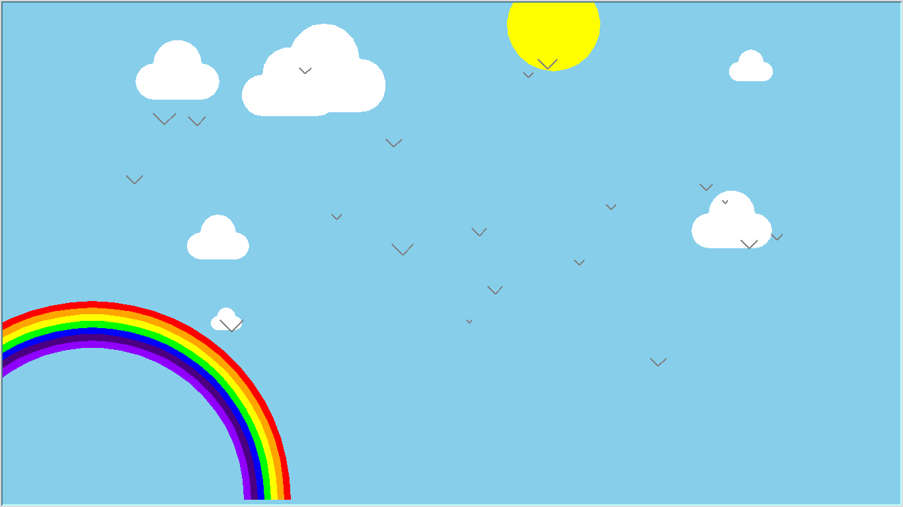
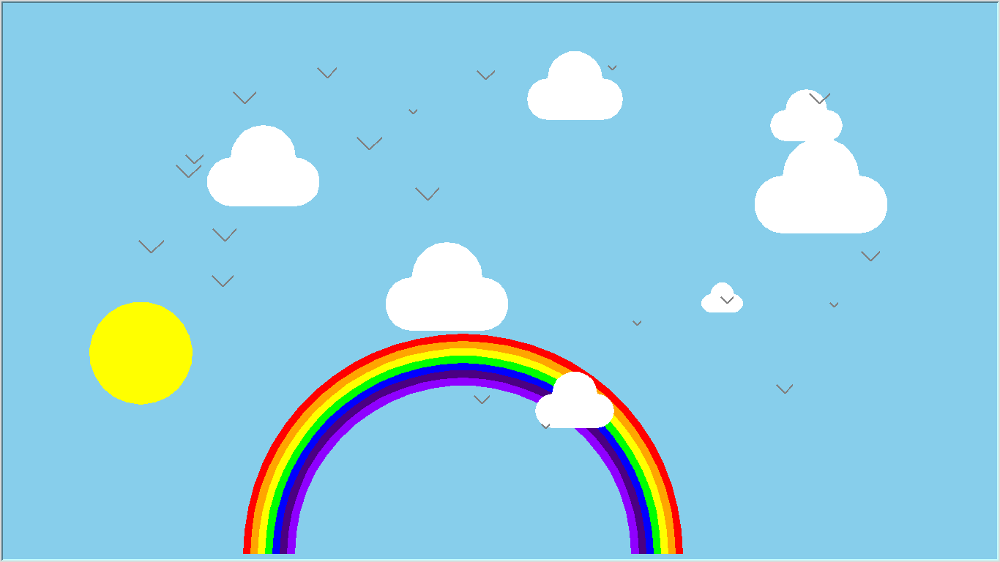
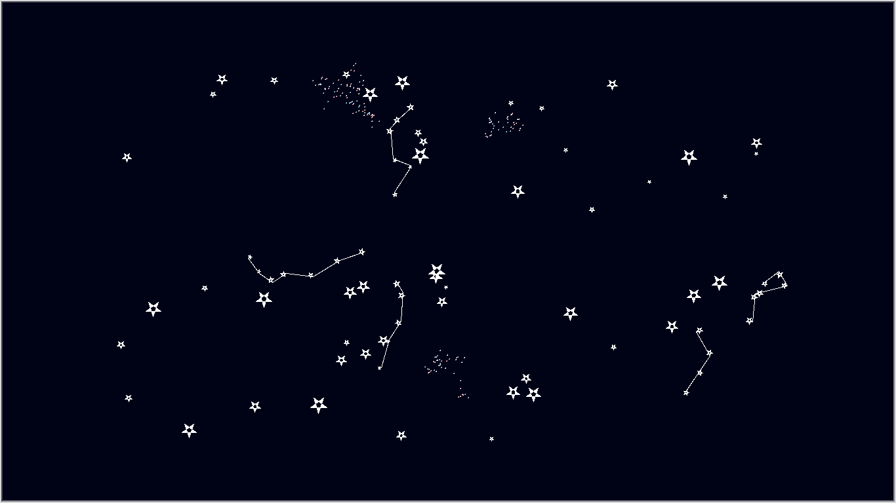

# Turtle-scripts

Collection of Python Turtle scripts

## bluesky.py
This one was made together with my two daugthers

## stars.py
This one is based on a python turtle tutorial found here: http://kodeklubben.github.io/python/stjerner_og_galakser/stjerner_og_galakser.html

